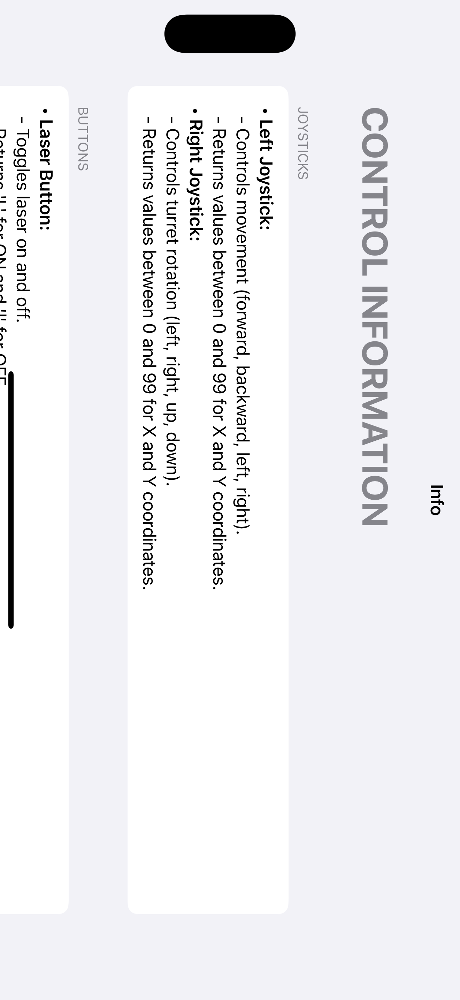
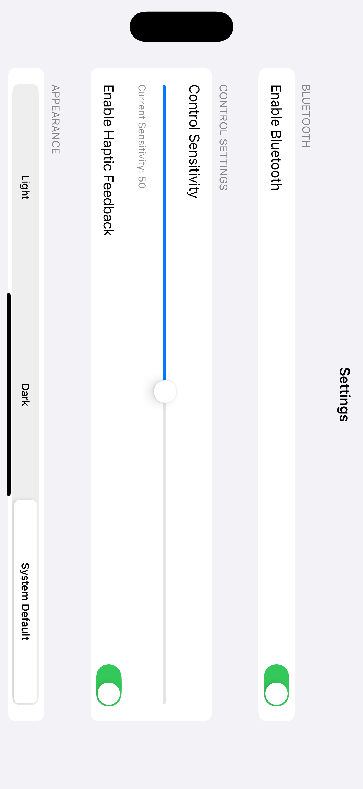
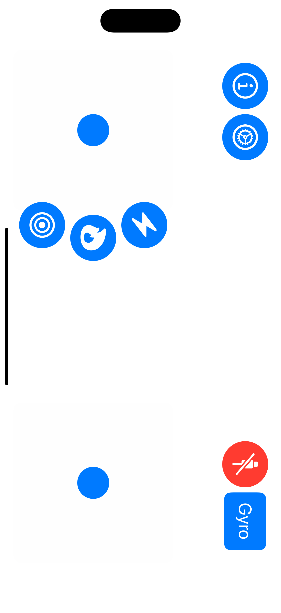

# JoystickRCVehicle

This project is a remote-controlled vehicle application built with Swift and SwiftUI. The application allows you to control a tank or car using Bluetooth communication. The app also includes advanced features like joystick control, turret rotation, and live camera feed integration.

## Features

- Dual joystick control for vehicle movement and turret rotation
- Bluetooth device discovery and connection
- Real-time data transmission and control
- Customizable sensitivity and appearance settings
- Integration with Firebase Crashlytics for error tracking

## Screenshots

### **Control Information Screen**


### **Settings Screen**


### **Main Control Interface**


> **Note:** Replace the image file names (e.g., `Simulator-Screenshot-01.png`) with the actual file paths in your GitHub repository.

## Installation

1. Clone the repository:
   ```bash
   git clone https://github.com/onderguler/JoystickRCVehicle.git
